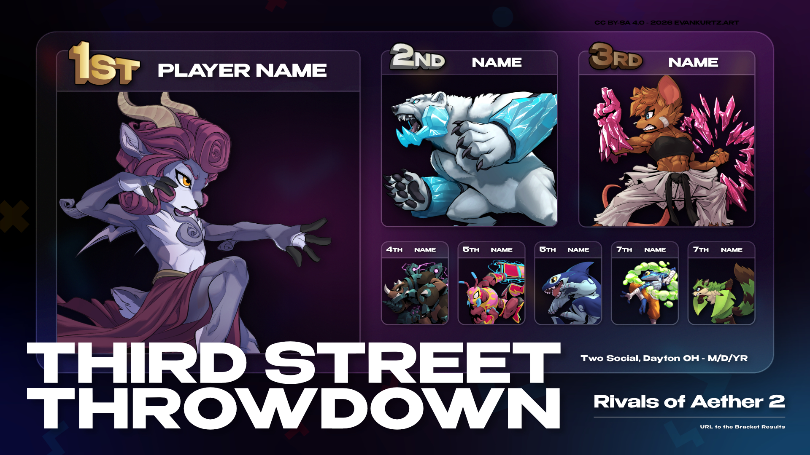

# DYT Local Scene Results Graphic Template
This is a template for making results graphics for our local platfighting scene.   

All that's needed to use this asset is [Affinity](https://www.affinity.studio/download), a free creative software by Canva.  
-It effectively replaces Adobe Photoshop, Illustrator, and InDesign all in one app!   

> [!Important]
> ***This file is licensed under CC BY-SA 4.0***, which basically means anyone can "share, remix, and adapt the work, even for commercial purposes, as long as you give appropriate credit and license your new creations under the same terms."

## How to Use
Asset types are grouped in the Layers panel, with everything locked except for what needs to be changed per export.  

 
You can double-click on unlocked text objects in the artboard to bring up the text tool.  
If the string is too long to fit on the line, try lowering the point size by .5 and/or decreasing the tracking (In the Position & Transform section of the Text>Character Panel).  

To change the character portraits, expand the locked mask layer to reveal the image object.   

 
Once the image is selected, click the Replace Image button on the toolbar.  

Go through the checklist and make sure that everything is correct before exporting.  
To export, simply navigate to File>Export or use the Ctrl+Alt+Shift+W shortcut. 
WEBP would probably look best with the background gradient, but since it still isn't fully supported, I usually export for JPG with the following settings:   
    

> [!Note]
> Included in the repository are character portraits for Melee and Rivals of Aether 2. I do not own these assets, and credit for those works goes solely to their respective owners.
